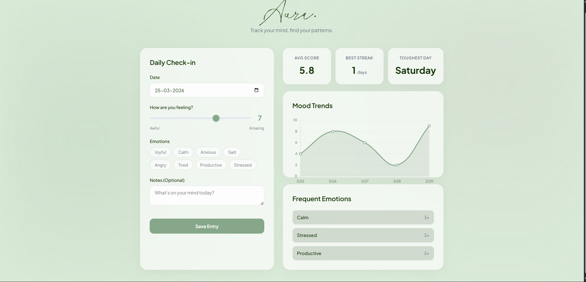

# Aura — Minimalist Mood Tracker

> Track your mind, find your patterns.



---

## 🌿 What is Aura?

Aura is a clean, minimal daily mood journal built with Python and Flask. No accounts, no notifications, no noise — just you logging how you feel every day and watching your patterns emerge over time.

---

## Features

- Daily mood check-in with a score from 1 to 10
- Emotion tags — Joyful, Calm, Anxious, Sad, Angry, Tired, Productive, Stressed
- Optional notes for the day
- Mood trend chart showing your last 7 days
- Tracks your average score, best streak, and toughest day
- Shows your most frequent emotions over time
- All data stored locally as a JSON file — no cloud, no tracking

---

## Tech Stack

| Layer | Technology |
|---|---|
| Backend | Python, Flask |
| Frontend | HTML, CSS, Vanilla JS |
| Data Storage | JSON file (local) |
| Charts | Chart.js |

---

## Run Locally

**Requirements:** Python 3.x

**Step 1 — Clone the repo**
```bash
git clone https://github.com/YOUR_USERNAME/aura-mood-tracker.git
cd aura-mood-tracker
```

**Step 2 — Install dependencies**
```bash
pip install flask
```

**Step 3 — Run the app**
```bash
python app.py
```

**Step 4 — Open in browser**
```
http://localhost:5000
```

---

## Project Structure

```
aura-mood-tracker/
├── app.py              ← Flask backend, handles saving and reading mood data
├── mood_data.json      ← Where all your entries are stored locally
├── templates/
│   └── index.html      ← Frontend UI (HTML + CSS + JS)
└── README.md
```

---

## How It Works

1. You fill in your daily check-in — date, mood score, emotions, optional note
2. Flask saves the entry to a local `mood_data.json` file
3. On load, Flask reads all past entries and sends them to the frontend
4. Chart.js renders your mood trend as a line chart
5. The stats (avg score, best streak, toughest day) are calculated from your history

---

## What I Learned Building This

- How to read and write JSON files in Python
- How Flask passes data from the backend to the frontend
- How to generate charts from real user data using Chart.js
- That designing something that feels calm to use is harder than it looks

---

## Part of #7DaysOfPython

This is **Day 3** of my 7 Days of Python challenge — one real, useful project every day for 7 days.

Follow along on [https://www.linkedin.com/in/navdeep-singh-207003310/] for daily updates.

---

## 📄 License

MIT — free to use, modify, and share.